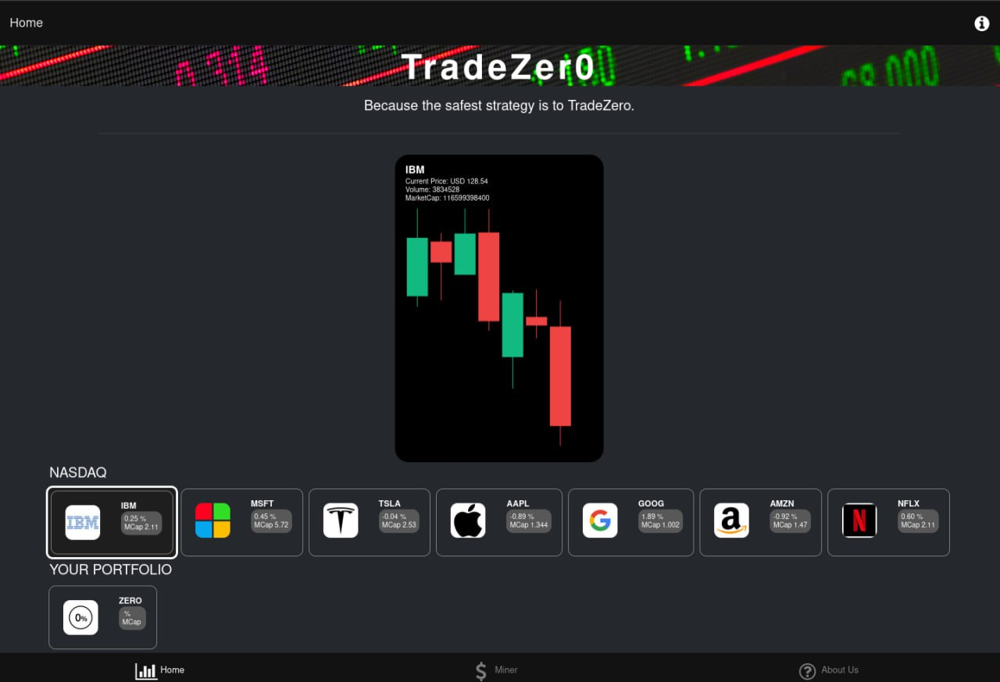

# Tradezero Frontend Microservice

Frontend service of the TradeZero application, which is intenteded to be used as a sample microservice architcture (MSA) application.

The serivce is built using Typescript and React Native, and uses animated charts to draw the candlestick graphs.


## Integration

In order the frontend to function properly it needs the following backend services:

 * Tradezero Pricer microservice [tradezero-pricer](https://github.com/mauroseb/tradezero-pricer/)
   
## ENVIRONMENT VARS

* **TZP_HOST** - TradeZero Pricer hostname or IP address
* **TZM_HOST** (OPTIONAL) - TradeZero Miner hostname or IP address

  
## Run

Instantiate a TradeZero frontend container.

```
podman run -d --name tradezero-frontend-1 -e TZP_HOST=192.168.0.1 -e TZM_HOST=192.168.0.2 -p 8000:8000 tradezero-frontend:0.1.0
```

## Screenshots




